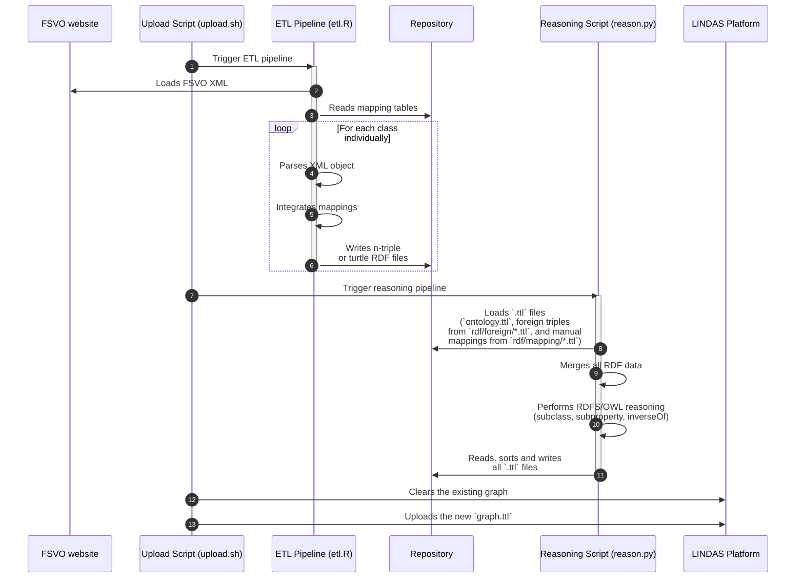

> [!WARNING]
> Currently, this project and the written data is in the prototype stage and should not be consumed by productive applications.

# Plant Protection Products as Linked Data

This project extracts the Swiss Plant Protection Product (PPP) registry, maps the data to RDF and publishes it on [LINDAS](https://lindas.admin.ch). The ETL logic lives in [`automation/etl.R`](automation/etl.R) and uses a few CSV files in [`tables/mapping`](tables/mapping) for manual mappings such as company identifiers or product categories.

[](https://blw-ofag-ufag.github.io/plant-protection/registry/index.html?id=D-7413)

A couple of small demonstration pages are available in the [`docs`](docs) folder and are hosted via GitHub Pages:

- [Example of the generic RDF object pages](https://agriculture.ld.admin.ch/plant-protection/W-7300) genertated by LINDAS/trifid.
- [Example product overview site.](https://blw-ofag-ufag.github.io/plant-protection/registry/?id=W-7300) At the moment, the shown product can only be switched via the URL by passing `?id=XYZ`, with `XYZ` being the W-number of any product.
- [Example of how any fetched table could look like on a federal webpage.](https://blw-ofag-ufag.github.io/plant-protection/table/)

These sites illustrate how linked data from LINDAS can be embedded in a website and **are not meant as full fledged applications**.

## ETL pipeline

The main R script, `etl.R`, initiates the process by downloading the Swiss Plant Protection Product Registry data as an XML file.
It then parses this XML and transforms the relevant elements—such as products, companies, and codes—into RDF triples using a custom ontology.

The ETL pipeline incorporates manually curated mapping tables in CSV and JSON formats. These tables are used to align internal classes and identifiers with established external ones, such as mapping company IDs to their ZEFIX registry entries or mapping product categories to subclasses of product in the ontology.

The Python script `reason.py` plays a crucial role in preparing the data for publication. It performs the following actions:

1. Merges all the generated and external RDF files into a single graph.
2. Applies RDFS and OWL reasoning to infer new relationships. This includes expanding class hierarchies (`rdfs:subClassOf`), property hierarchies (`rdfs:subPropertyOf`), and reciprocal relationships (`owl:inverseOf`).
3. Deterministically sorts the triples to ensure consistency between versions.
4. Serializes the final, consolidated graph into a single Turtle file (`graph.ttl`).

Here's a graphical overview of these steps:



All of the provided example/demonstration webpages query the data directly via the LINDAS SPARQL endpoint.

## Querying the dataset

The resulting RDF is loaded into the graph `<https://lindas.admin.ch/foag/plant-protection>` on the public LINDAS SPARQL endpoint at `https://lindas.admin.ch/query`. SPARQL is the query language for RDF datasets.

> [!NOTE]
> The following examples can be opened directly in your browser via the [s.zazuko.com](https://s.zazuko.com/) shortener. Via the links, you can view the SPARQL query, edit it yourself and query the LINDAS triple store however you wish.

## Example queries

### [Companies that sell product applicable agains potato late blight](https://s.zazuko.com/2VSLCsf)

```rq
PREFIX schema: <http://schema.org/>
PREFIX : <https://agriculture.ld.admin.ch/plant-protection/>

SELECT
  ?company
  (GROUP_CONCAT(CONCAT(?name, " (", ?WNbr, ")"); separator=", ") AS ?Product)
  (COUNT(?product) AS ?Number)

WHERE
{
  ?product schema:name ?name ;
    :hasPermissionHolder/schema:legalName ?company ;
    :federalAdmissionNumber ?WNbr ;
    :indication [
      :cropGroup/schema:name "Kartoffeln"@de ;
      :cropStressor/schema:name "Kraut- und Knollenfäule"@de
        ] .
}

GROUP BY ?company
ORDER BY DESC(?Number)
```

### [Get all subclasses of `:Product` with names and descriptions](https://s.zazuko.com/yWk6Fz)

```rq
PREFIX schema: <http://schema.org/>
PREFIX rdfs: <http://www.w3.org/2000/01/rdf-schema#>
PREFIX : <https://agriculture.ld.admin.ch/plant-protection/>

SELECT ?label ?comment

WHERE
{
  ?class rdfs:subClassOf* :Product ;
    schema:name ?label ;
    schema:description ?comment .

  VALUES ?lang { "en" }
  FILTER (
    LANG(?label) = ?lang &&
    LANG(?comment) = ?lang
  )
}

ORDER BY ?class
```

### [Federated query: A list of all products that contain neurotoxic ingredients and and may be used against insects](https://s.zazuko.com/UAfswS)

```rq
PREFIX : <https://agriculture.ld.admin.ch/plant-protection/>
PREFIX owl: <http://www.w3.org/2002/07/owl#>
PREFIX rdfs: <http://www.w3.org/2000/01/rdf-schema#>
PREFIX schema: <http://schema.org/>
PREFIX wdt:  <http://www.wikidata.org/prop/direct/>

SELECT DISTINCT ?product ?name ?company

WHERE
{
  # search SRPPP data for products and bind wikidataTaxon + chebi keys
  ?product schema:name ?name ;
    :hasPermissionHolder/schema:legalName ?company ;
    :indication/:cropStressor/:isDefinedByBiologicalTaxon ?wikidataTaxon ;
    :hasComponentPortion/:substance/(:hasChebiIdentity|:partialChebiIdentity) ?chebi .
  
  # query Wikidata to only select taxa that are a subgroup of "Insecta" --> i.e. that are insects
  SERVICE <https://qlever.cs.uni-freiburg.de/api/wikidata>
  {
    ?wikidataTaxon wdt:P171*/wdt:P225 "Insecta" .
  }
  
  # query RHEA/ChEBI for chemical entities that have the role "neurotoxin"
  SERVICE <https://sparql.rhea-db.org/sparql/> {
    ?chebi rdfs:subClassOf/owl:someValuesFrom/rdfs:label "neurotoxin" .
  }
}
```

## Other queries

- [What insecticide indication has most obligations?](https://s.zazuko.com/mkNyy1)
- [Count number of indications per application area](https://s.zazuko.com/cCvhUJ)
- [Get all class and property names and descriptions](https://s.zazuko.com/EJKZAU)
- [Count the instances per product subclass](https://s.zazuko.com/5j9ftQ)
- [A list of all substances, their IUPAC name, role, average percentages and how many products they are in](https://s.zazuko.com/2K54Ld9)
- [Count the involved pests and crops per indication](https://s.zazuko.com/yAWBE5)
- [A list of all units, the SRPPP PK and their occurences](https://s.zazuko.com/hQVZfk)
- [List of all companies that have permission to sell plant protection products](https://s.zazuko.com/21xrM6T)
- [Federated query on wikidata database](https://s.zazuko.com/36zyoKS) Get all taxon names + authors for pests that belong to the order of *Lepidoptera*.
- [Federated query on CheBI database:](https://s.zazuko.com/3mxZVCq) Query the CheBI database via RHEA for chemical entity names, roles, chemical formulas and foreign keys to other databases.
